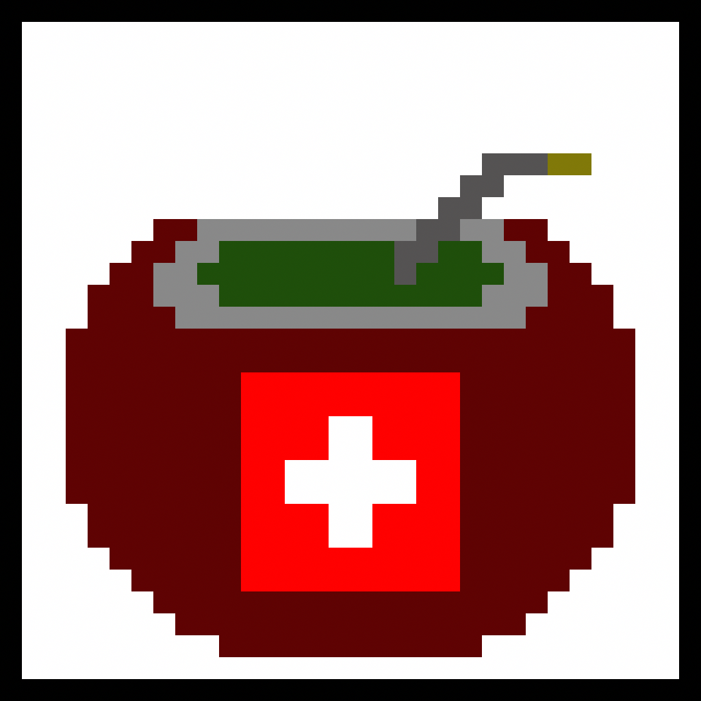

	

This is the repository for [matelab.ch](https://matelab.ch), a community-driven site about [mate-based](https://en.wikipedia.org/wiki/Mate_(drink)) beverages and caffeine-based competitors available in Switzerland.

## Contributing
Existing products can be found under `./data`. The template for a new product is located at `./templates/product.yml`. To change or add data you can submit pull requests. Also feel free to add yourself to the `README.md`. 

If you're not a GitHub user you can contact me and I'll update the data accordingly. Please also send your source (URL, picture of beverage) for me to verify the data.

### Missing data
This project needs price data from as many stores as possible. Please submit data from as many widely available stores as possible. (Coop, Migros, Denner, Lidl, Aldi usw.)

| Product                  | Data             | Comment                                                |
|--------------------------|------------------|--------------------------------------------------------|
| all i need mate tea      | Caffeine         |                                                        |
| Coop Karma Mate & Orange | Caffeine         |                                                        |
| Outlawz Holunder Mate    | Caffeine         | Needs manual testing, manufacturer  did not measure it |
| Pri Mate                 | Caffeine         |                                                        |

## Contributors
+ [@rtfmkiesel](https://twitter.com/rtfmkiesel)
+ [@SigristFabian](https://twitter.com/SigristFabian)
+ [@volerysandro](https://twitter.com/volerysandro)
+ [@SvBrunner](https://github.com/SvBrunner)

## Kudos
+ [piskelapp/piskel](https://github.com/piskelapp/piskel/)